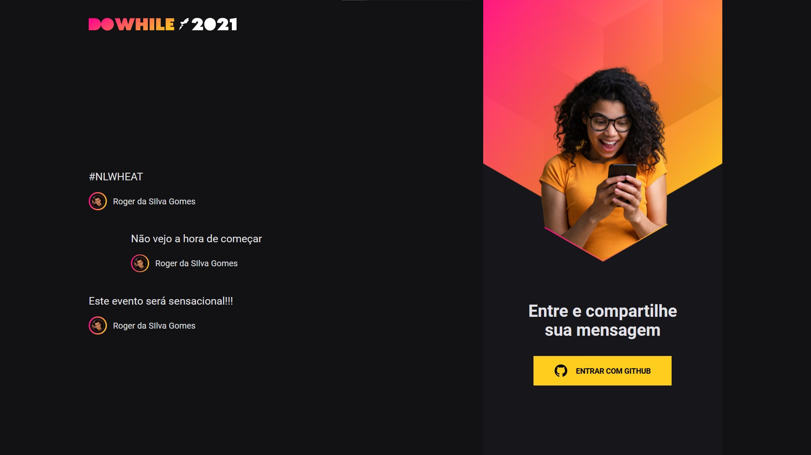
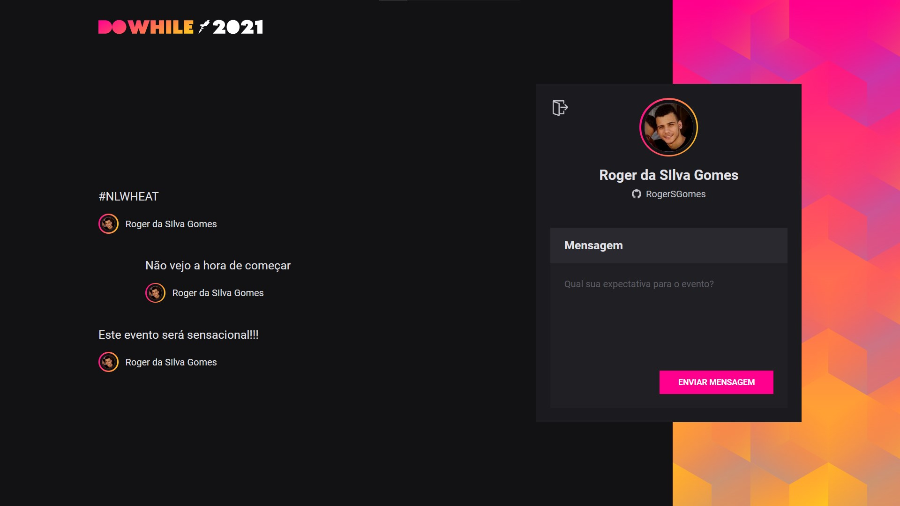

<h1>NLW Heat</h1>
  <h2>Sumário</h2>
    <ul>
      <li><a href="#sobre">Sobre</a></li>
      <li><a href="#tecnologias">Técnologias utilizadas</a></li>
      <li><a href="#requisitos">Pré-requisitos</a></li>
      <li><a href="#instalacao">Rodando a aplicação</a></li>
      <li><a href="#galeria">Galeria Front-End</a></li>
      <li><a href="#galeria2">Galeria Back-End</a></li>
    </ul>    
  <h2 id='sobre'>💬 Sobre</h2>
  O projeto desenvolvido na NLW desta semana foi um sistema onde os usuários podem dizer suas expectativas para o DoWhile, evento disponibilizado pela Rocketseat que acontecerá em dezembro deste ano.
  
  <h2 id='tecnologias'>👨‍💻 Técnologias utilizadas</h2>
  <h3> Front-End </h3>
  <ul>
    <li>React</li>
    <li>React-native: expo-cli</li>
    <li>Typescript</li>
    <li>Sass</li>
    <li>Github: oauth (autenticação)</li>
    <li>Vite: fast-refresh</li>
  </ul>
  
  <h3> Back-End </h3>
  
  <ul>
    <li>Node.js</li>
    <li>Prisma</li>
    <li>json</li>
    <li>Sqlite</li>
    <li>Web sockets</li>
    <li>Typescript</li>
  </ul>
  
  <h3> Ferramentas de produção </h3>
  <ul>
    <li>Insomnia</li>
    <li>VisualStudioCode</li>
    <li>Prisma</li>
    <li>PowerShell</li>
  </ul>
  
  <h2 id='requisitos'>🧩 Pré-requisitos para rodar a aplicação</h2>
  
Tenha certeza de que seu dispositivo tem o Node.js instalado, senão instale-o no link:

  <ul>
    <a href="https://nodejs.org/en/download/">https://nodejs.org/en/download/</a>
  </ul>
  
O Node.js é um software de código aberto, multiplataforma, baseado no interpretador V8 do Google e que permite a execução de códigos JavaScript fora de um navegador web. Para verificar se ele está instalado, basta executar o seguinte comando no prompt:

  
    node --version
  
  
Juntamente com a instalação do Node.js, seu gerenciador de pacotes (npm) deve ter sido instalado. Para verificar se o npm está presente em seu computador, basta executar o seguinte comando no prompt:

  
    npm --version

  <h2 id='instalacao'>🚀 Rodando a Aplicação</h2>
  
Para começar, vamos extrair os arquivos em seu dispositivo e acessar a pasta "backend" para configurar todo acesso com as APIs e com o banco de dados.

  <h3>Configurando o Back-end</h3>
  
Assim que estiver dentro da pasta "backend" basta rodar, em seu prompt de comando, o seguinte comando:

  
     npm install
     
  
Este comando será responsável por instalar todas as dependências do projeto, para que ele execute da forma correta.

  
Em seguida, vamos configurar o banco de dados. Para isso, basta executar o comando:

  
     prisma migrate dev
     
  
Para finalizar só deixar o servidor local rodando em seu dispositivo executando o comando:

  
     npm run dev
     
  
Deixe este prompt de comando minimizado executando o servidor e acesse um novo prompt para configurar o Front-end. Se o servidor não estiver rodando, não será possível utilizar as páginas web nem o aplicativo.

  <h3>Configurando o Front-end (WEB)</h3>
  
Para acessar a página web também é muito simples. Basta procurar a pasta "web" e, novamente, rodar o comando de instalação de dependências:

  
     npm install
     
  
Em seguida executar o comando:

  
     npm run dev
     
  
Para a configuração da página web é isso, agora é só acessá-la em seu navegador pela url "http://localhost:3000"
  
  <h2 id='galeria'>🖼 Galeria Front-End</h2>
  
  
  
